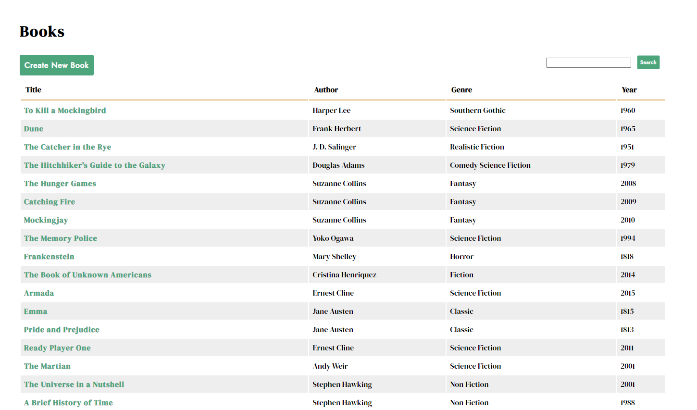

# TechDegree Project #8: SQL Library Manager - 

* Application for managing a library's collection of books.
* Using a SQLite database, with a Sequelize ORM interface, 
CRUD operations are controlled through a Node.js and Express backend.  

# Technologies used

* Node.js/Express
* Pug
* Sequelize
* JavaScript
* HTML
* CSS

# Features

* Users can perform all CRUD operations, along with a case-insensitive search 
for books based on either author, title, genre, or year (partial matches recoginized).

# Instructions:

* After downloading the project files, run the following from the project root directory
```
npm i
```
* Once the dependencies have been installed to your machine enter the following:
```
npm start
```
* You can view the project locally by directing your browser to localhost:3000
* In order to populate the seed data (library books), run the following command 
from an additional terminal:
```
npx sequelize-cli db:seed:all
```
* At this point, you should be able to refresh the page <kbd>Ctrl+Shift+R</kbd> on Windows, and see the initial collection.
* Now you should see the following in your browser: 

